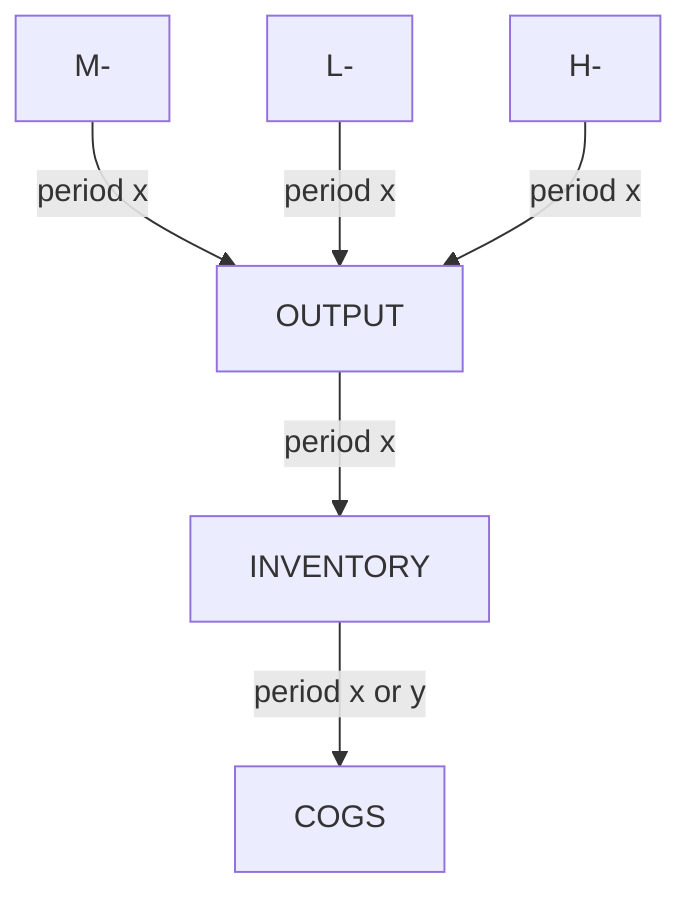

会计与产值差异

$$
\begin{align}
a &:= actual \\
b &:= benchmark \\
+ &:= stock \ in \\
- &:= used \ or\ charge\ out \\
h &:= manufacturing \  overhead \\
g &:= SGA \\
\sigma &:= variance \ or\ under \ over \ absorption \\
\tau &:= total\ product\ cost\ i.e.\ m + l + h
\end{align}
$$

# FROM MLH to shipout

| Financial costing                                            | Variable costing                                             | Quasi-cash                                                   |
| ------------------------------------------------------------ | ------------------------------------------------------------ | ------------------------------------------------------------ |
| Revenue：$q^ap^a$                                            | $q^ap^a$                                                     | $q^{+a}p^a$                                                  |
| - benchmark cost[^1]：  $$\begin{align} &(m^b + l^b + h^b) \times q^a \end{align}$$ | $$\begin{align} &(m^b + l^b) \times q^a \end{align}$$        | $$M^- + L^- + H^-$$                                          |
| - cost variance： $$\begin{align} &\tau^{\sigma} \times q^a  \end{align}$$   may not break dwon to mlh | $$\begin{align} &M^{\sigma} \\ &L^{\sigma}  \end{align}$$  assuming m, l is variable | The variance may come  from different period, and  different product mix |
| = Gross Margin：                                             | = CM^gross^                                                  |                                                              |
|                                                              | - h^v^                                                       |                                                              |
|                                                              | - g^v^                                                       |                                                              |
|                                                              | = CM                                                         |                                                              |
| - SGA: g                                                     | -FC: (h^f^ + g^f^ )                                          | -g                                                           |
| = EBIT^accounting^:                                          | = EBIT^variableCosting^:                                     | = EBIT^quasi-cash^:                                          |
|                                                              |                                                              |                                                              |

$$
\begin{align}
M^- &= \sum_i (m_i^b \pm m_i^\sigma ) q_i^{+a} \\
M^{\sigma} &= \sum_i m_i^{\sigma} q_i^{+a}
\end{align}
$$

[^1]: This may be further broken down to target cost and engineer cost.

